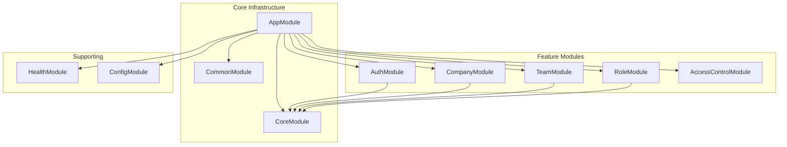

# Claude Development Guide: Acme Backend

**Core Philosophy:** This document is a configuration file for Claude Code. Instructions are declarative, precise, and structured. Follow rules and checklists exactly as specified.

## Table of Contents

1. [Core Principles](#core-principles)
2. [Development Workflow](#development-workflow)
3. [Architecture Overview](#architecture-overview)
4. [Module Guidelines](#module-guidelines)
5. [Testing Strategy](#testing-strategy)
6. [Security & Authorization](#security--authorization)
7. [Database & Sequelize Patterns](#database--sequelize-patterns)
8. [Migration Status](#migration-status)
9. [API Development Checklist](#api-development-checklist)
10. [AI Tool Integration](#ai-tool-integration)

---

## Core Principles

```yaml
# --- CRITICAL VALIDATION RULES ---
server_validation:
  mandatory: true
  command: 'npm run start:dev'
  success_criteria:
    - 'Server starts without errors'
    - 'Health endpoint responds: GET /health'
    - 'Swagger docs load: GET /api'

test_validation:
  mandatory: true
  commands:
    unit: 'npm test'
    e2e: 'npm run test:e2e'
    integration: 'npm run test:integration'
    all_slow: 'npm run test:all-slow'
  success_criteria: 'All tests must pass'

lint_validation:
  mandatory: true
  commands:
    check: 'npm run lint:check'
    fix: 'npm run lint:fix'
  success_criteria: 'No ESLint errors or warnings'

# --- SECURITY CONFIGURATION ---
security:
  authentication:
    strategy: 'JWT'
    guard: 'JwtAuthGuard'
    location: 'Header: Authorization'
    scheme: 'Bearer'
  authorization:
    guard: 'PermissionsGuard'
    decorator: '@RequirePermissions(...permissions)'
  multi_tenancy:
    model: 'company_id'
    enforcement: 'All queries MUST include company_id in WHERE clause'
  default_policy: 'deny'
  public_routes:
    - 'POST /companies/register-vendor'
    - 'GET /health'
    - 'GET /api'
```

---

## Development Workflow

### Server Validation (MANDATORY)

```bash
# Before marking ANY task complete:
npm run start:dev        # Server MUST start
curl localhost:3000/health  # MUST return 200 OK
```

### Test Validation (MANDATORY)

```bash
# For all changes:
npm test                 # Unit tests MUST pass
npm run test:e2e        # E2E tests MUST pass
npm run test:all-slow   # ALL tests MUST pass before commit
```

### Lint Validation (MANDATORY)

```bash
# Before marking ANY task complete:
npm run lint:check      # Check for ESLint errors and warnings
npm run lint:fix        # Auto-fix ESLint issues
```

### Common Commands

```bash
# Development
npm run start:dev       # Start with hot-reload
npm run start:debug     # Start with debugger
npx sequelize-cli db:migrate  # Run migrations

# Testing
npm run test:watch      # TDD mode
npm run test:cov        # Coverage report
npm run test:security   # Security tests
npm run test:performance # Performance tests

# Code Quality
npm run lint:check      # Check for linting issues
npm run lint:fix        # Fix linting issues
npm run format          # Format code
npm run build          # TypeScript build
```

### Environment Configuration (CRITICAL)

```yaml
# MANDATORY: Always use .env.local for local development and testing
environment_setup:
  local_development:
    file: '.env.local'
    description: 'Local development environment - used for all local testing and development'
    usage: 'ALWAYS use this when running locally'
    commands:
      - 'npm run start:dev'  # Automatically uses .env.local
      - 'npm test'           # Automatically uses .env.local
      - 'npm run test:e2e'   # Automatically uses .env.local

  staging_environment:
    file: '.env.development'
    description: 'Development/Staging server environment'
    usage: 'Used ONLY on the dev/staging server - NEVER locally'
    deployment: 'Automatically used by CI/CD pipeline for staging'

  production_environment:
    file: '.env.production'
    description: 'Production server environment'
    usage: 'Used ONLY on the production server - NEVER locally'
    deployment: 'Automatically used by CI/CD pipeline for production'

# Environment File Priority (NestJS ConfigModule)
environment_loading_order:
  1: '.env.local'      # Highest priority (if NODE_ENV !== production)
  2: '.env.[NODE_ENV]' # Environment-specific file
  3: '.env'            # Default fallback

# CRITICAL: Before ANY local development or testing
local_setup_checklist:
  - [ ] Ensure .env.local exists with correct local database credentials
  - [ ] Verify .env.local has local Auth0 test credentials
  - [ ] Confirm .env.local points to local MySQL instance
  - [ ] Never commit .env.local to version control
```

---

## Architecture Overview



### Module Status

| Module        | Status         | Key Features                |
| ------------- | -------------- | --------------------------- |
| Auth          | ✅ Complete    | JWT auth, Auth0 integration |
| Company       | 🚧 In Progress | Multi-tenant management     |
| Team          | 🚧 In Progress | Team/member management      |
| Role          | 🚧 In Progress | Permissions system          |
| AccessControl | ✅ Complete    | Business validation guard   |
| Health        | ✅ Complete    | Health checks               |
| Config        | ✅ Complete    | Client configuration        |

---

## Module Guidelines

### Guard Usage Pattern

```typescript
// MANDATORY: All protected endpoints
@Controller('teams')
@UseGuards(JwtAuthGuard) // Authentication first
export class TeamController {
  @Post()
  @UseGuards(PermissionsGuard) // Then authorization
  @RequirePermissions('teams:create:own')
  async createTeam(@CurrentUser() user: User, @Body() dto: CreateTeamDto) {
    // Implementation
  }
}
```

### Service Pattern

```typescript
// MANDATORY: Transaction handling
@Injectable()
export class TeamService {
  constructor(
    @InjectModel(Team) private teamModel: typeof Team,
    @Inject(Sequelize) private sequelize: Sequelize
  ) {}

  async createTeam(user: User, dto: CreateTeamDto): Promise<Team> {
    // 1. Validation
    await this.validateTeamCreation(user, dto);

    // 2. Transaction
    return this.sequelize.transaction(async (transaction) => {
      const team = await this.teamModel.create(
        {
          ...dto,
          company_id: user.company_id, // MANDATORY: Multi-tenant isolation
        },
        { transaction }
      );

      // 3. Related operations
      await this.createTeamOwner(team.id, dto.owner_id, transaction);

      return team;
    });
  }
}
```

---

## Testing Strategy

### Test Organization

```
src/
├── modules/
│   ├── team/
│   │   ├── team.service.ts
│   │   └── team.service.spec.ts  # Unit test (co-located)
test/
├── e2e/                          # End-to-end tests
├── integration/                  # Integration tests
├── security/                     # Security tests
├── performance/                  # Performance tests
├── database/                     # Database tests
└── utils/                        # Test utilities
```

### TDD Workflow (MANDATORY)

```typescript
// 1. RED: Write failing test first
describe('TeamService', () => {
  it('should throw BadRequestException when LEGAL team has no lawyers', async () => {
    const dto = { name: 'Legal Team', type: 'LEGAL', members: [] };
    await expect(service.validateTeamCreation(dto))
      .rejects.toThrow(BadRequestException);
  });
});

// 2. GREEN: Minimal implementation
async validateTeamCreation(dto: CreateTeamDto): Promise<void> {
  if (dto.type === 'LEGAL' && dto.members.length === 0) {
    throw new BadRequestException('Legal teams must have at least one lawyer');
  }
}

// 3. REFACTOR: Improve while keeping tests green
```

### Test Requirements

- Unit tests: 90% minimum coverage
- E2E tests: All API endpoints
- Security tests: All auth/authz scenarios
- Performance tests: Critical queries

---

## Security & Authorization

### Multi-Tenant Data Access (CRITICAL)

```typescript
// MANDATORY: All repository methods
@Injectable()
export class TeamRepository {
  async findByCompany(companyId: string): Promise<Team[]> {
    return this.teamModel.findAll({
      where: {
        company_id: companyId, // ALWAYS include company_id
      },
    });
  }
}

// FORBIDDEN: Never query without tenant isolation
// ❌ this.teamModel.findAll({ where: { status: 'active' } })
```

### Permission Patterns

```typescript
// Granular permissions format: resource:action:scope
'teams:create:own'; // Can create teams in own company
'teams:create:any'; // Can create teams in any company (ACME_ADMIN)
'teams:read:assigned'; // Can read teams they're member of
'teams:update:managed'; // Can update teams they manage
```

---

## Database & Sequelize Patterns

### Entity Requirements

```typescript
@Table({
  tableName: 'teams',
  paranoid: true, // MANDATORY: Soft deletes only
  timestamps: true,
  underscored: true,
})
export class Team extends Model {
  @Column({
    type: DataType.UUID,
    primaryKey: true,
    defaultValue: DataType.UUIDV4,
  })
  id: string;

  @ForeignKey(() => Company)
  @Column({
    type: DataType.UUID,
    allowNull: false,
  })
  company_id: string; // MANDATORY: Multi-tenant field

  @BelongsTo(() => Company)
  company: Company;
}
```

### Migration Standards & Best Practices

#### Core Migration Philosophy

Every migration must be **EXPLICIT**, **REVERSIBLE**, **ATOMIC**, and **IDEMPOTENT**.

#### 1. Cross-Environment Compatibility

```javascript
// GOOD: Version-aware functional indexes
module.exports = {
  async up(queryInterface, Sequelize) {
    await queryInterface.sequelize.transaction(async (transaction) => {
      // Always create standard index as fallback
      await queryInterface.addIndex('Companies', ['name'], {
        name: 'idx_companies_name_search',
        comment: 'Standard index for cross-version compatibility',
        transaction,
      });

      // Try advanced features with graceful fallback
      try {
        const [versionResult] = await queryInterface.sequelize.query(
          'SELECT VERSION() as version',
          { transaction }
        );
        const version = versionResult[0].version;
        // Only use functional indexes on MySQL 8.0.13+
        if (version.match(/^[89]\./) && !version.includes('mariadb')) {
          await queryInterface.removeIndex('Companies', 'idx_companies_name_search', {
            transaction,
          });
          await queryInterface.sequelize.query(
            'CREATE INDEX idx_companies_name_ci ON Companies ((LOWER(name)))',
            { transaction }
          );
        }
      } catch (error) {
        console.log('Advanced features not supported, using standard index');
      }
    });
  },
};
```

#### 2. Foreign Key Constraint Management

```javascript
// MANDATORY: Always explicitly name constraints
module.exports = {
  async up(queryInterface, Sequelize) {
    await queryInterface.sequelize.transaction(async (transaction) => {
      // 1. Add column first
      await queryInterface.addColumn(
        'Teams',
        'owner_user_id',
        {
          type: Sequelize.UUID,
          allowNull: false,
        },
        { transaction }
      );

      // 2. Add named constraint
      await queryInterface.addConstraint('Teams', {
        type: 'foreign key',
        fields: ['owner_user_id'],
        name: 'fk_teams_owner_user_id', // EXPLICIT NAME
        references: {
          table: 'Users',
          field: 'id',
        },
        onDelete: 'CASCADE',
        onUpdate: 'CASCADE',
        transaction,
      });
    });
  },

  async down(queryInterface, Sequelize) {
    await queryInterface.sequelize.transaction(async (transaction) => {
      // CRITICAL: Remove constraint before column (reverse order)
      await queryInterface.removeConstraint('Teams', 'fk_teams_owner_user_id', { transaction });
      await queryInterface.removeColumn('Teams', 'owner_user_id', { transaction });
    });
  },
};
```

#### 3. Robust Constraint Discovery

```javascript
// Handle auto-generated constraint names
async function findForeignKeyConstraint(queryInterface, tableName, columnName, referencedTable) {
  const [constraints] = await queryInterface.sequelize.query(`
    SELECT CONSTRAINT_NAME 
    FROM INFORMATION_SCHEMA.KEY_COLUMN_USAGE 
    WHERE TABLE_NAME = '${tableName}' 
      AND COLUMN_NAME = '${columnName}' 
      AND REFERENCED_TABLE_NAME = '${referencedTable}'
      AND TABLE_SCHEMA = DATABASE()
  `);
  return constraints.length > 0 ? constraints[0].CONSTRAINT_NAME : null;
}

// Usage in migration
const constraintName = await findForeignKeyConstraint(
  queryInterface,
  'Teams',
  'manager_id',
  'Users'
);
if (constraintName) {
  await queryInterface.removeConstraint('Teams', constraintName, { transaction });
}
```

#### 4. Safe Index Operations

```javascript
// MANDATORY: Check existence before operations
module.exports = {
  async up(queryInterface, Sequelize) {
    await queryInterface.sequelize.transaction(async (transaction) => {
      const indexes = await queryInterface.showIndex('Teams');
      const existingIndexNames = indexes.map((index) => index.name);

      if (!existingIndexNames.includes('idx_teams_category_active')) {
        await queryInterface.addIndex('Teams', ['category', 'is_active'], {
          name: 'idx_teams_category_active',
          comment: 'Composite index for category and status queries',
          transaction,
        });
      }
    });
  },

  async down(queryInterface, Sequelize) {
    await queryInterface.sequelize.transaction(async (transaction) => {
      try {
        await queryInterface.removeIndex('Teams', 'idx_teams_category_active', { transaction });
      } catch (error) {
        console.warn(`Index may not exist: ${error.message}`);
      }
    });
  },
};
```

#### 5. Table Naming Consistency (Critical)

```javascript
// CRITICAL: Table names must be consistent across all migrations
// Problem: Creation uses PascalCase, indexing uses snake_case
// ❌ WRONG:
await queryInterface.createTable('UserRoles', { ... }); // PascalCase
await queryInterface.addIndex('user_roles', ['user_id']); // snake_case - FAILS!

// ✅ CORRECT: Choose one convention and stick to it
await queryInterface.createTable('UserRoles', { ... });
await queryInterface.addIndex('UserRoles', ['user_id']); // Consistent PascalCase

// ✅ ALTERNATIVE: Use snake_case everywhere
await queryInterface.createTable('user_roles', { ... });
await queryInterface.addIndex('user_roles', ['user_id']); // Consistent snake_case

// Environment Check for Case Sensitivity Issues
async function checkTableExists(queryInterface, tableName) {
  try {
    const [result] = await queryInterface.sequelize.query(
      "SHOW TABLES LIKE ?", { replacements: [tableName] }
    );
    return result.length > 0;
  } catch (error) {
    return false;
  }
}

// Usage in migration
const tableExists = await checkTableExists(queryInterface, 'UserRoles') ||
                   await checkTableExists(queryInterface, 'user_roles');
if (!tableExists) {
  throw new Error('Required table not found - check table naming consistency');
}
```

#### 6. Environment-Specific Logic

```javascript
// Handle different environments gracefully
module.exports = {
  async up(queryInterface, Sequelize) {
    // Skip data seeding in production
    if (process.env.NODE_ENV === 'production') {
      console.log('Skipping seed data for production environment');
      return;
    }

    await queryInterface.bulkInsert('Companies', [
      { name: 'Test Company', type: 'CLIENT', status: 'ACTIVE' },
    ]);
  },
};
```

#### 7. Migration Testing Checklist

**Local Development:**

- [ ] Create migration: `npx sequelize-cli migration:generate --name descriptive-name`
- [ ] Test forward: `npx sequelize-cli db:migrate`
- [ ] Verify schema changes
- [ ] Test backward: `npx sequelize-cli db:migrate:undo`
- [ ] Test forward again: `npx sequelize-cli db:migrate`

**CI/CD Pipeline:**

- [ ] Fresh database setup
- [ ] Full migration from scratch: `npx sequelize-cli db:migrate`
- [ ] Run all tests against migrated schema
- [ ] Test complete rollback: `npx sequelize-cli db:migrate:undo:all`

#### 8. Common Pitfalls & Solutions

| Issue                               | Solution                                                      |
| ----------------------------------- | ------------------------------------------------------------- |
| **Auto-generated constraint names** | Always use explicit `name` in `addConstraint()`               |
| **Functional indexes failing**      | Use version detection + graceful fallback                     |
| **Check constraints on FK columns** | Avoid - use application validation instead                    |
| **Wrong operation order**           | Constraints before columns in down migrations                 |
| **Large table locking**             | Use `ALGORITHM=INPLACE, LOCK=NONE` for MySQL 8+               |
| **Data + schema changes**           | Separate into multiple migrations                             |
| **Table name case sensitivity**     | Be consistent: Use either PascalCase OR snake_case everywhere |
| **Duplicate constraint names**      | Check constraint existence before creating                    |

#### 9. Dangerous Operations (Avoid)

```javascript
// ❌ NEVER: Auto-generated names
await queryInterface.addColumn('table', 'column', {
  references: { model: 'other_table', key: 'id' }, // Creates unpredictable name
});

// ❌ NEVER: Version-specific syntax without detection
await queryInterface.addIndex('table', [
  queryInterface.sequelize.fn('LOWER', queryInterface.sequelize.col('name')),
]); // Fails on MySQL < 8.0.13

// ❌ NEVER: Operations without transactions
await queryInterface.addColumn('table', 'col1');
await queryInterface.addColumn('table', 'col2'); // Can fail midway

// ✅ ALWAYS: Explicit, transaction-wrapped, version-aware
await queryInterface.sequelize.transaction(async (transaction) => {
  await queryInterface.addColumn('table', 'col1', {}, { transaction });
  await queryInterface.addColumn('table', 'col2', {}, { transaction });
});
```

---

## Migration Status

### Express → NestJS Translation

| Express Pattern       | NestJS Pattern                       | Status |
| --------------------- | ------------------------------------ | ------ |
| `app.use(middleware)` | `@UseGuards()`, `@UseInterceptors()` | ✅     |
| `req.user`            | `@CurrentUser() user: User`          | ✅     |
| `res.json()`          | Return object from controller        | ✅     |
| Error middleware      | `@Catch()` exception filters         | ✅     |
| Route handlers        | Controller methods with decorators   | ✅     |

---

## API Development Checklist

### New Endpoint Checklist

- [ ] Create feature branch: `feature/TICKET-ID-description`
- [ ] Write failing E2E test in `test/MODULE_NAME.e2e-spec.ts`
- [ ] Create/update DTOs with validation decorators
- [ ] Create/update Sequelize entity if needed
- [ ] Implement controller with guards: `@UseGuards(JwtAuthGuard, PermissionsGuard)`
- [ ] Implement service with business logic
- [ ] Add repository method with tenant isolation
- [ ] Write unit tests for service (90% coverage)
- [ ] Verify server starts: `npm run start:dev`
- [ ] Verify all tests pass: `npm test && npm run test:e2e`
- [ ] Update Swagger documentation

### Error Handling Pattern

```typescript
// Service throws specific exceptions
throw new BadRequestException('Specific error message');
throw new ForbiddenException('Access denied');
throw new NotFoundException('Resource not found');

// Global filter handles formatting
// Never catch errors in services unless for specific handling
```

---

## AI Tool Integration

### Available MCP Tools

```yaml
gemini:
  use_for:
    - Complex debugging: 'mcp__multi-ai-collab__gemini_debug'
    - Architecture decisions: 'mcp__multi-ai-collab__gemini_architecture'
    - Code review: 'mcp__multi-ai-collab__gemini_code_review'
    - Performance optimization: 'mcp__multi-ai-collab__gemini_think_deep'

serena:
  primary_use_cases:
    - Code navigation and understanding
    - Symbol-based editing and refactoring
    - Pattern searching across codebase
    - Finding code relationships and references
    - Test generation and analysis

  # Code Understanding Workflow
  understanding_workflow:
    1. get_symbols_overview: 'Get high-level view of modules/files'
    2. find_symbol: 'Locate specific classes, methods, functions'
    3. find_referencing_symbols: 'Understand code relationships'
    4. search_for_pattern: 'Find patterns, decorators, specific code'

  # Common Serena Commands for this Project
  common_commands:
    project_overview: "get_symbols_overview(relative_path='src')"
    module_exploration: "get_symbols_overview(relative_path='src/modules/team')"
    class_methods: "find_symbol(name_path='TeamService', depth=1)"
    method_body: "find_symbol(name_path='TeamService/createTeam', include_body=True)"
    find_guards: "search_for_pattern(pattern='@UseGuards|@RequirePermissions')"
    find_entities: "search_for_pattern(pattern='@Table|@Column')"
    find_tests: "search_for_pattern(pattern='describe\\(', paths_include_glob='**/*.spec.ts')"
    check_multitenant: "search_for_pattern(pattern='findAll|create|update', context_lines_before=3)"

  # Best Practices
  best_practices:
    - 'Always use get_symbols_overview before detailed exploration'
    - 'Use relative_path parameter to restrict searches to specific modules'
    - 'Prefer symbol-based editing over regex for large changes'
    - 'Use find_referencing_symbols to understand impact of changes'
    - 'Leverage context lines when searching for patterns'

context7:
  use_for:
    - Library documentation lookup
    - API reference retrieval
```

### When to Use AI Tools

- **Complex Bugs**: Always consult Gemini for challenging technical issues
- **Architecture**: Validate major design decisions with Gemini
- **Performance**: Use Gemini for query optimization suggestions
- **Security**: Review auth logic with Gemini for vulnerabilities

---

## Quick Reference

### Project Structure

```
acme_server/
├── src/
│   ├── modules/        # Feature modules
│   ├── core/          # Core infrastructure
│   ├── common/        # Shared utilities
│   ├── database/      # Database config
│   └── main.ts        # Application entry
├── test/              # Comprehensive tests
├── config/            # Sequelize config
└── migrations/        # Database migrations
```

### Environment Variables

```bash
# Database
DB_HOST, DB_PORT, DB_USER, DB_PASS, DB_NAME

# Auth0
AUTH0_ISSUER_BASE_URL, AUTH0_CLIENT_ID, AUTH0_CLIENT_SECRET

# Client Versions
MIN_IOS_VERSION, MIN_ANDROID_VERSION, MIN_WEB_VERSION
```

### Requirements & Context Reference

**ALWAYS consult `.cursor/requirements/` for detailed specifications:**

- Search by domain: `search_for_pattern(pattern="REQ-COMP-", paths_include_glob=".cursor/requirements/*.md")`
- All business rules, data models, and API specifications are documented there
- Use requirements for planning implementation and understanding application context
- Cross-reference REQ-XXX-001 identifiers for detailed acceptance criteria

### Critical Business Rules

1. **Multi-tenancy**: Every query MUST include company_id
2. **Soft Deletes**: Never hard delete data (paranoid: true)
3. **Audit Trail**: All modifications logged via AuditService
4. **Legal Teams**: Must always have at least one lawyer
5. **Task Assignment**: Cannot remove user with active tasks
6. **Permission Format**: `resource:action:scope` (e.g., `teams:create:own`)
7. **Task States**: LOCKED → OPEN → IN_PROGRESS → PENDING_REVIEW → COMPLETED

---

## Final Checklist Before Task Completion

**EVERY task must satisfy ALL criteria:**

- [ ] Server starts: `npm run start:dev`
- [ ] All tests pass: `npm run test:all-slow`
- [ ] TypeScript builds: `npm run build`
- [ ] No linting errors: `npm run lint:check`
- [ ] Migrations run: `npx sequelize-cli db:migrate`
- [ ] API documented in Swagger
- [ ] Security validated (auth + permissions)
- [ ] Multi-tenant isolation verified
- [ ] Error handling implemented
- [ ] Logging added for debugging

**Remember**: No task is complete until the server runs AND all tests pass.
